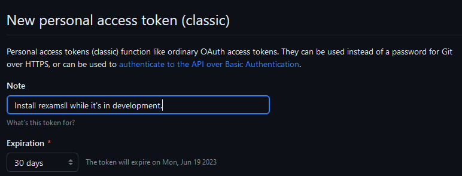

```{r knitr-opts, include = FALSE}
knitr::opts_chunk$set(
  collapse = TRUE,
  comment = "#>"
)
```

# Install

While `rexamsll` is in development, the most recently pushed version can be
installed through GitHub using the devtools library.

```
install.packages("devtools")
```

In order to gain access to this package's source code, you'll need a GitHub
account and permission from a project administrator to access the repository.
If haven't worked with git before, check out
https://docs.github.com/en/get-started/getting-started-with-git.

Once you have a git account, you need to create an authentication token so R
can access your repositories. This just means signing in once to get a special
password from GitHub that R can use from then on.

To start, input your GitHub username and the email associated with your account
in their respective strings below, and run the code cell.

```
usethis::use_git_config(user.name = "<USERNAME>",
                        user.email = "<YOUR>@<EMAIL>.com")
usethis::create_github_token()
```

This should open your browser and ask you to sign into GitHub before bringing
you to a page titled "New personal access token".

Start by providing a reason for this token's creation in the "Note" section.
You can also change the expiration date on the token, though the default value
of 30 days works perfectly well.



You should not need to change any of the selections in the "Select scopes"
section. The "repo" section that is enabled by default should be all that you
need to give R access to.


Now, click the green "Create Token" at the bottom of the page. You should be
presented with a page that looks like the following, with some code that starts
with `ghp_`. (Note that the code has been censored in this example image.)


Copy this code and, optionally, save it somewhere secure to use later. Paste it
over the text that says `<AUTH CODE HERE>` in the chunk below. Be sure to delete
the `<` and `>`; only your authentication code should be within the quotes.
Then run the code chunk to install rexamsll.

```
library(devtools)
install_github("examLing/rexamsll", ref = "main",
               auth_token = "<AUTH CODE HERE>")
```

To check that rexamsll was installed properly, run the following code chunk
and make sure there are no errors.

```
library(rexamsll)
```
