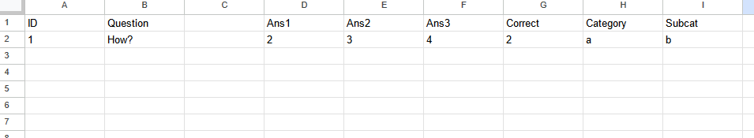

```{r, include = FALSE}
knitr::opts_chunk$set(
  collapse = TRUE,
  comment = "#>"
)
```

# Spreadsheet Validation

When importing questions from a spreadsheet, like one created in Google Sheets
or Excel, `rexamsll` goes through a list of checks to validate the sheet. If
any check fails, your function will throw an error.

## "Dataframe has no values."

**Example:**

```
Error in rexamsll:::validate_df(df) : 
  Dataframe has no values. Did you select the wrong sheet?
```

This error occurs when you try to import data from a spreadsheet that with only
a header. Double check that you pasted the correct url and that you selected
the proper sheet index.

Also, it's good to note that images don't count as cell values.

## "Error in if (nrow(df) == 0)..."

**Example:**

```
Error in if (nrow(df) == 0) stop("Dataframe has no values. Did you select the wrong sheet?") : 
  argument is of length zero
In addition: Warning message:
No data found on worksheet.
```

This error occurs when you try to import data from a spreadsheet with *no*
values (not even a header). Since there is no data in the sheet, R fails to
load it at all.

Double check that you're importing from the correct URL and sheet.

## "Missing columns: ..."

**Example:**

```
Error in rexamsll:::validate_df(df) : Missing columns: type
```



Your header is missing at least one of the required columns:

* Question
* Type
* Correct
* Category
* Subcat

Add the listed headers to the first row of your sheet, and check
[Build the Sheet](#section2_1) to learn how to use each of these columns.

Side note: Interestingly, these headers don't need to be on the first row;
they just need to be the first *non-empty* row of the sheet. You can have
as many *empty* rows above them as you'd like.

## "No answer columns found"

**Example:**

```
Error in rexamsll:::validate_df(df) : No answer columns found
```


`rexamsll` requires at least ONE column of the format "Ans#" in the sheet, or
it will throw this error.

At the moment, `rexamsll` throws this error even if all questions are of the
**string** type, meaning the columns are empty. In this case, just add a single
"Ans1" column and leave it blank.

## "No values in answer columns."

**Example:**

```
Error in which(na_rows & !sr_rows) %>% paste0(collapse = ", ") %>% sprintf(msg,  : 
  Row 1 has no values in answer columns.
```


This error is thrown when a **schoice** or **mchoice** question has no
answers to choose from. To fix this, *either*:

1. Add answers to this row.
2. Set the "Type" to **string**.
